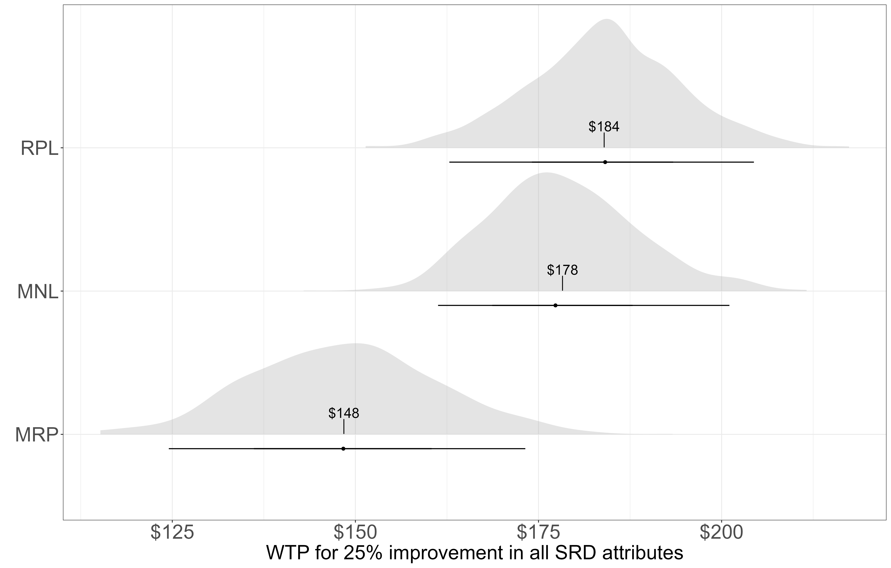

## Motivation

Stated preference (SP) research increasingly relies on opt-in, non-probability internet panels. These samples are fast and affordable, but they are rarely representative of the population researchers want to make inferences about. The result is often that the willingness-to-pay (WTP) estimates from standard discrete choice models reflect *sample-level* preferences, a convenience sample of online panelists, rather than the *population-level* preferences that matter for policy.

Multilevel regression and post-stratification (MRP) offers a principled, three-step solution to this well known issue [@gelman1997]. The core insight is simple: instead of modelling unobserved individual heterogeneity, MRP models heterogeneity over *observed demographic groups*. This makes it possible to impute WTP for every demographic subgroup in the population and then aggregate those estimates using census counts to produce a population-weighted mean.


## Introduction

The purpose of this guide is walk through the three multilevel regression and post-stratification (MRP) steps to accompany the methodological paper [@lloydsmith2026]. The three steps are:

1. **Estimation**: estimate a choice model with group-level random effects over respondent characteristics
2. **Imputation**: simulate WTP for every demographic subgroup in the post-stratification table
3. **Post-stratification**: aggregate subgroup WTP estimates to the population level using census counts as weights

We use the Saskatchewan River Delta (SRD) choice experiment as a concrete example. Each step is illustrated with the key equation and the corresponding R code. All code blocks are set to `eval: false`; they are intended as templates to adapt to your own data.

This guide uses a fully Bayesian estimation framework, fitting all choice models in R via the `brms` package [@bürkner2017] using Stan [@carpenter2017] and samples from the posterior using the No-U-Turn Sampler [@hoffman2014nuts]. Bayesian estimation is a natural fit for MRP: the posterior draws from the fitted model propagate parameter uncertainty directly through the imputation and post-stratification steps, yielding credible intervals for population WTP without any additional bootstrapping.

Other useful introductions to MRP using R outside the stated preference context include

- [Kennedy & Gabry (2020)](https://mc-stan.org/rstanarm/articles/mrp.html) — MRP with `rstanarm`; a R tutorial using a public opinion example
- [Lopez-Martin, Phillips & Gelman (2022)](https://bookdown.org/jl5522/MRP-case-studies/) — *MRP Case Studies*; an online book covering election forecasting, health, and other applications
- [Alexander (2023)](https://tellingstorieswithdata.com/15-mrp.html) — Chapter 16 of *Telling Stories with Data*; a beginner-friendly walkthrough with Canadian opinion data

---

::: {.callout-note}
## How to run this code

All code in this guide is drawn directly from the replication repository at
[github.com/plloydsmith/MRPandSP](https://github.com/plloydsmith/MRPandSP).
To run it yourself in [Positron](https://positron.posit.co/):

1. **Clone the repository** — `git clone https://github.com/plloydsmith/MRPandSP.git` — or download it as a ZIP from GitHub.
2. **Open the folder in Positron** — use **File → Open Folder** and select the `MRPandSP` directory. Positron sets the working directory to the folder root automatically, which is required for all file paths (e.g. `data/derived/SRDClean.csv`) to resolve correctly.
3. **Open the user guide** — open `docs/user-guide-mrp-srd.qmd` from the Explorer panel.
4. **Run code chunks sequentially** — click the green play button on each chunk, or use **Run → Run All** from the Quarto editor toolbar. The chunks build on one another: data preparation must run before estimation, estimation before imputation, and imputation before post-stratification and graphing.
5. **Pre-fitted models** — fitting the Bayesian models is computationally intensive (30–60 minutes on a modern laptop). Pre-fitted `.rds` files are stored in `output/srd/` so you can skip straight to the imputation and graphing steps if preferred.
:::

---

## Packages

```{r}
#| eval: false
library(tidyverse)   # data wrangling and ggplot2
library(brms)        # Bayesian choice model estimation
library(tidybayes)   # tidy extraction of posterior draws
library(ggdist)      # slab + interval plots
library(ggrepel)     # non-overlapping text labels
```

---

## The Saskatchewan River Delta Case Study Data

The SRD study estimated Canadian households' WTP to restore the ecological condition of a large freshwater inland delta located between Saskatchewan and Manitoba [@lika2025]. A quota-based opt-in internet panel sample of 949 respondents was used (after removing 16 yea-sayers). Respondents completed six choice tasks, each presenting a status-quo option and two program alternatives described by:

- **Four ecological attributes**: lake sturgeon population, waterfowl population, muskrat abundance, and the proportion of habitat in good ecological condition
- **One cost attribute**: an annual increase in income taxes for 20 years

The target population was all Canadian adults, so post-stratification data come from the 2021 Census Public Use Microdata File (PUMF), with subgroups defined by age-gender, income, education, and province.

### Data preparation

The raw choice data (`SRDModified.csv`) contains one row per respondent-task combination similar to the wide format of the R package [*apollo*](https://www.apollochoicemodelling.com/) Each alternative (status quo = 1, program A = 2, program B = 3) has its own column for every attribute. The first five rows of the raw data look like:

| id  | choice | sturgeon_1 | sturgeon_2 | sturgeon_3 | ... | cost_1 | cost_2 | cost_3 |
|-----|--------|-----------|-----------|-----------|-----|--------|--------|--------|
| 169 | 1      | 35        | 100       | 10        | ... | 0      | 345    | 50     |
| 169 | 1      | 35        | 100       | 10        | ... | 0      | 130    | 130    |
| 169 | 3      | 35        | 100       | 10        | ... | 0      | 345    | 25     |

We use the R package *brms* to estimate the choice models, which requires setting up the data in a specific way. In particular, we set the status quo (alternative 1) as the reference category and express all attribute values as differences from the status quo level. Each attribute column is transformed as, for example:

$$
\texttt{sturgeon\_2} \leftarrow \frac{\texttt{sturgeon\_2} - \texttt{sturgeon\_1}}{\texttt{attribute\_multiplier}}
$$

$$
\texttt{sturgeon\_3} \leftarrow \frac{\texttt{sturgeon\_3} - \texttt{sturgeon\_1}}{\texttt{attribute\_multiplier}}
$$

and analogously for `waterfowl`, `muskrat`, and `habitat`. The cost columns are divided by `cost_multiplier_linear` (= 100) to keep parameter scales comparable. After transformation, the status-quo columns (`_1`) are dropped. The cleaned dataset (`SRDClean.csv`) is used for all estimation:

```{r}
#| eval: false
cost_multiplier_linear <- 100
attribute_multiplier   <- 10

df_ce <- read_csv("data/derived/SRDModified.csv") |>
  mutate(
    across(starts_with("cost_"),     ~ . / cost_multiplier_linear),
    across(starts_with("sturgeon"),  ~ (.x - sturgeon_1)  / attribute_multiplier),
    across(starts_with("waterfowl"), ~ (.x - waterfowl_1) / attribute_multiplier),
    across(starts_with("muskrat"),   ~ (.x - muskrat_1)   / attribute_multiplier),
    across(starts_with("habitat"),   ~ (.x - habitat_1)   / attribute_multiplier)
  ) |>
  select(-c(sturgeon_1, waterfowl_1, muskrat_1, habitat_1, cost_1))
```

After transformation, the first rows of `df_ce` look like:

| id  | choice | sturgeon_2 | sturgeon_3 | waterfowl_2 | waterfowl_3 | ... | cost_2 | cost_3 |
|-----|--------|-----------|-----------|------------|------------|-----|--------|--------|
| 169 | 1      | 6.5       | −2.5      | 6.0        | 0.0        | ... | 3.45   | 0.50   |
| 169 | 1      | 6.5       | −2.5      | 2.5        | 5.0        | ... | 1.30   | 1.30   |
| 169 | 3      | 6.5       | −2.5      | −1.0       | 2.5        | ... | 3.45   | 0.25   |

Values are now deviations from the status quo: a positive `sturgeon_2` of 6.5 means alternative 2 offers a lake sturgeon level 65 percentage points above the status quo (after dividing by 10).

---

## Step 1 — Model Estimation in WTP-Space

### The utility model

We work in WTP-space. Starting from the standard random utility model, we normalise through the price parameter $(-\alpha^*)$ to obtain a utility function where the non-price parameters are directly interpretable as marginal WTP:

$$
U_{ijt} = ASC_{program} + \lambda(\omega_i \, x_{jt} - p_{jt}) + \varepsilon_{ijt},
\quad
\varepsilon_{ijt} \sim \textrm{Gumbel}\!\left(0, \frac{\pi^2}{6}\right)
$$ {#eq-wtp-space}

where $\omega_i = \beta^* / (-\alpha^*)$ is the vector of marginal WTP for the non-monetary attributes, $\lambda = -\alpha^*/\sigma$ is a scale parameter, and $ASC_{program}$ is an alternative-specific constant for the two program alternatives.

### Group-level heterogeneity

The key feature of MRP is *where* heterogeneity in $\omega_i$ is specified. Rather than treating preferences as varying freely across individuals, MRP decomposes $\omega_i$ into a population mean and additive deviations for each demographic group the respondent belongs to:

$$
\omega_i = \beta_0 + \alpha_{a,g[i]}^{\text{age-gender}} + \alpha_{p[i]}^{\text{province}} + \alpha_{m[i]}^{\text{income}} + \alpha_{e[i]}^{\text{education}}
$$ {#eq-group-re}

Each $\alpha$ term is a group-level random effect that shifts WTP up or down for respondents in that demographic cell. For the SRD, there are 10 age-gender groups, 7 income categories, 5 education categories, and 11 provinces — yielding 6 mean WTP parameters and 16 standard deviation parameters in total.

### `brms` formula

The WTP-space utility functions for the two program alternatives are specified in `brms` using `nlf()`, which handles the multiplicative structure between the scale parameter `bcost` ($\lambda$) and the WTP parameters (`bsturgeon`, `bhabitat`, etc., representing $\omega_i$):

```{r}
#| eval: false
nlf_mu2 <- nlf(
  mu2 ~ bprogram +
    bcost *
      (-cost_2 +
        bsturgeon * sturgeon_2 + bhabitat * habitat_2 +
        bwaterfowl * waterfowl_2 + bmuskrat * muskrat_2)
)

nlf_mu3 <- nlf(
  mu3 ~ bprogram +
    bcost *
      (-cost_3 +
        bsturgeon * sturgeon_3 + bhabitat * habitat_3 +
        bwaterfowl * waterfowl_3 + bmuskrat * muskrat_3)
)
```

### Priors

With $\omega_i$, $\alpha$, and $\sigma_r$ now defined, we can state the priors. The fixed parameters receive weakly informative normal priors; the group-level standard deviations $\sigma_r$ receive half-Cauchy priors, which allow heavy tails when the data support heterogeneity across demographic groups [@gelman2006]:

| Parameter | Prior |
|---|---|
| Mean WTP ($\beta_0$) and program ASC | $N(0, 1)$ |
| Scale ($\lambda$ = `bcost`) | $\text{half-}N(0, 1)$ |
| Attribute WTP ($\omega$) | $N(0, 1)$ |
| Group-level SDs ($\sigma_r$) | $\text{half-Cauchy}(0, 1)$ |

```{r}
#| eval: false
# Fixed priors — shared across all models
prior_fixed <- c(
  prior(normal(0, 1), nlpar = "bcost", lb = 0),   # scale (lambda), bounded positive
  prior(normal(0, 1), nlpar = "bprogram")           # ASC
)

prior_attributes <- c(
  prior(normal(0, 1), nlpar = "bsturgeon"),
  prior(normal(0, 1), nlpar = "bhabitat"),
  prior(normal(0, 1), nlpar = "bwaterfowl"),
  prior(normal(0, 1), nlpar = "bmuskrat")
)

# SD priors — used in MRP (group level)
prior_sd <- c(
  prior(cauchy(0, 1), class = "sd", nlpar = "bsturgeon"),
  prior(cauchy(0, 1), class = "sd", nlpar = "bhabitat"),
  prior(cauchy(0, 1), class = "sd", nlpar = "bwaterfowl"),
  prior(cauchy(0, 1), class = "sd", nlpar = "bmuskrat")
)
```

### `brm()` call

With the utility formula, group-level structure, and priors defined, the model is estimated with a single `brm()` call. The `(1 | group_var)` syntax in each WTP subformula adds a group-level intercept implementing @eq-group-re. `bcost` and `bprogram` have no random effects and are therefore fixed across all groups:

```{r}
#| eval: false
fit_mrp <- brm(
  bf(
    choice ~ 1,
    nlf_mu2,
    nlf_mu3,
    bprogram ~ 1,
    bcost ~ 1,
    bsturgeon ~ 1 +
      (1 | age_gender) + (1 | education_group) +
      (1 | income_group) + (1 | province),
    bhabitat ~ 1 +
      (1 | age_gender) + (1 | education_group) +
      (1 | income_group) + (1 | province),
    bwaterfowl ~ 1 +
      (1 | age_gender) + (1 | education_group) +
      (1 | income_group) + (1 | province),
    bmuskrat ~ 1 +
      (1 | age_gender) + (1 | education_group) +
      (1 | income_group) + (1 | province),
    family = categorical(refcat = 1)
  ),
  data = df_ce,
  prior = c(prior_fixed, prior_attributes, prior_sd),
  chains = 4,
  iter = 2000,
  cores = 4,
  seed = 13,
  backend = "cmdstanr",
  control = list(adapt_delta = .95),
  file = "models/srd/wtps_srd_mrp.rds"
)
```

---

## Step 2 — Imputing Subgroup WTP

### The imputation equation

Because the model is estimated in WTP-space, the model parameters *are* WTP. For subgroup $s$ (defined by a unique combination of age-gender, income, education, and province), marginal WTP for each attribute is:

$$
\hat{WTP}_s = \hat{\beta}_0 + \hat{\alpha}_{a,g[s]}^{\text{age-gender}} + \hat{\alpha}_{p[s]}^{\text{province}} + \hat{\alpha}_{m[s]}^{\text{income}} + \hat{\alpha}_{e[s]}^{\text{education}}
$$

Working with Bayesian posterior draws propagates full parameter uncertainty through to the imputed WTP values.

### The poststratification table

The poststratification table lists every demographic subgroup along with its population count from the 2021 Census PUMF. For the SRD, there are 3,201 subgroups ($10_{\text{age-gender}} \times 5_{\text{education}} \times 7_{\text{income}} \times 11_{\text{province}}$ minus cells absent from the census). Respondents appear in only 18% of these cells, so partial pooling across groups is essential for imputing the remaining 82%.

### R code: build the poststrat table and impute WTP

```{r}
#| eval: false
attribute_multiplier <- 10  # scaling factor applied to cost variable

df_poststrat <- read_csv("data/derived/PoststratCountsCanada.csv") |>
  mutate(age_gender = paste0(age_group, "_", gender)) |>
  summarise(
    count = sum(count),
    .by = c(province, age_gender, income_group, education_group)
  ) |>
  mutate(bid = 0, vote_yes = 0)

# Replace spaces with dots to match brms's naming convention for group levels
df_poststrat <- df_poststrat |>
  mutate(across(
    c(age_gender, education_group, income_group, province),
    ~ str_replace_all(.x, " ", ".")
  ))

# --- Helper: extract fixed-effect draws for WTP attributes ---
get_fixed_draws <- function(fit) {
  as_tibble(fixef(fit, summary = FALSE)) |>
    mutate(.draw = row_number()) |>
    pivot_longer(-.draw, names_to = "parameter", values_to = "fixed") |>
    mutate(parameter = str_remove(parameter, "_Intercept")) |>
    filter(!(parameter %in% c("bcost", "bprogram")))  # keep only WTP params
}

# --- Main function: compute cell-level WTP for every posterior draw (MRP) ---
get_mrp_wtp <- function(fit, df_fixed) {

  # Extract random-effect draws for each grouping variable
  extract_random <- function(fit, group_var, value_name) {
    pattern <- paste0("^r_", group_var, "__")
    as_draws_df(fit) |>
      select(.draw, matches(pattern)) |>
      pivot_longer(
        -.draw,
        names_to = c("parameter", group_var),
        names_pattern = paste0("r_", group_var, "__(.+)\\[(.+),Intercept\\]"),
        values_to = value_name
      )
  }

  df_age  <- extract_random(fit, "age_gender",       "random_age_gender")
  df_edu  <- extract_random(fit, "education_group",  "random_education_group")
  df_inc  <- extract_random(fit, "income_group",     "random_income_group")
  df_prov <- extract_random(fit, "province",         "random_province")

  # Cross every poststrat cell with every posterior draw, then join random effects
  df_poststrat |>
    cross_join(df_fixed) |>
    left_join(df_age,  by = c("age_gender",      ".draw", "parameter")) |>
    left_join(df_edu,  by = c("education_group", ".draw", "parameter")) |>
    left_join(df_inc,  by = c("income_group",    ".draw", "parameter")) |>
    left_join(df_prov, by = c("province",        ".draw", "parameter")) |>
    mutate(
      # KEY STEP: cell WTP = fixed intercept + all four random effects,
      # then rescaled by the attribute multiplier
      wtp = (fixed +
               random_age_gender +
               random_education_group +
               random_income_group +
               random_province) *
        attribute_multiplier
    ) |>
    select(-bid, -vote_yes, -starts_with("random"), -fixed)
}

# Run the MRP imputation
wtp_mrp <- get_mrp_wtp(fit_mrp, get_fixed_draws(fit_mrp)) |>
  mutate(model = "mrp")
```

The `cross_join()` creates one row for every (poststrat cell × posterior draw × attribute) combination. The `left_join()` calls attach the appropriate random-effect draw for each cell. The `mutate()` block is the key step: it sums the fixed intercept and all four group-level random effects to get the cell-level WTP, then rescales by `attribute_multiplier` to undo the cost scaling applied during estimation.

---

## Step 3 — Post-Stratification to Get Population WTP

### The aggregation formula

Given cell-level WTP estimates $\hat{WTP}_s$ and census counts $N_s$, the population-weighted mean is:

$$
\hat{WTP}^{MRP} = \frac{\sum_{s=1}^{S} N_s \times \hat{WTP}_s}{\sum_{s=1}^{S} N_s}
$$ {#eq-mrp-step3}

We repeat this calculation for every posterior draw to obtain the full posterior distribution of the population-level estimate.

### R code: aggregate to population mean

```{r}
#| eval: false
wtp_poststrat |>
  summarise(
    wtp_mean = weighted.mean(wtp, w = count),
    .by = c(.draw, parameter)
  ) |>
  summarise(
    mean  = mean(wtp_mean),
    lb90  = quantile(wtp_mean, 0.05),
    ub90  = quantile(wtp_mean, 0.95),
    .by   = parameter
  )
```

The first `summarise()` computes the census-weighted mean WTP *within* each posterior draw — one number per (draw × attribute) combination. The second `summarise()` summarises across draws to produce a posterior mean and 90% credible interval.

**Subgroup estimates** are obtained by filtering `wtp_poststrat` before aggregating. For example, WTP by education group:

```{r}
#| eval: false
wtp_poststrat |>
  filter(model == "mrp") |>
  summarise(
    wtp_mean = weighted.mean(wtp, w = count),
    .by = c(.draw, parameter, education_group) # add sub group here
  ) |>
  summarise(
    mean = mean(wtp_mean),
    lb90 = quantile(wtp_mean, 0.05),
    ub90 = quantile(wtp_mean, 0.95),
    .by  = c(parameter, income_group)
  )
```

This uses the same post-stratification logic but within each education group rather than across the full population — no additional modelling required.

---

## Results

To contextualise the MRP estimates we also estimate two standard discrete choice models on the same data: a multinomial logit (MNL) with fixed effects only, and a random parameters logit (RPL) with individual-level random effects. The full code for these models is presented in the appendix. @fig-mean-all reproduces Figure 7 in @lloydsmith2026 and compares population-level WTP for a 25% improvement in all SRD attributes across all three models. The MRP estimate is the census-weighted population mean; the MNL and RPL estimates are unweighted sample means. Slabs show the posterior distribution; point ranges show 66% and 95% credible intervals; labels show posterior means. Code to reproduce this figure is provided in the [Appendix](#appendix-full-r-code).

{#fig-mean-all}


---

## Summary

I hope this guide provides a clear, practical introduction to using MRP in choice models for stated preference research and beyond.

For formal performance comparisons between MRP, weighting, and fixed-parameter post-stratification under varying nonresponse bias scenarios, see the [full paper](../MRPandSPPaper.pdf) [@lloydsmith2026]. But for most applications, the code in this guide is all you need to get started.

## References {.unnumbered}

::: {#refs}
:::

---

## Appendix: Model Code {#appendix-full-r-code}

### MNL model

The MNL model has fixed effects only — no random effects. It produces a single population-mean WTP for each attribute:

```{r}
#| eval: false
fit_mnl <- brm(
  bf(
    choice ~ 1,
    nlf_mu2,
    nlf_mu3,
    bprogram ~ 1,
    bcost ~ 1,
    bsturgeon ~ 1,
    bhabitat ~ 1,
    bwaterfowl ~ 1,
    bmuskrat ~ 1,
    family = categorical(refcat = 1)
  ),
  data = df_ce,
  prior = c(prior_fixed, prior_attributes),
  chains = 4,
  iter = 2000,
  cores = 4,
  backend = "cmdstanr",
  file = "models/srd/wtps_srd_mnl.rds"
)
```

### RPL model

The RPL model adds individual-level (`id`) random effects to capture unobserved preference heterogeneity across respondents:

```{r}
#| eval: false
fit_rpl <- brm(
  bf(
    choice ~ 1,
    nlf_mu2,
    nlf_mu3,
    bprogram ~ 1 + (1 | id),
    bcost ~ 1,
    bsturgeon ~ 1 + (1 | id),
    bhabitat ~ 1 + (1 | id),
    bwaterfowl ~ 1 + (1 | id),
    bmuskrat ~ 1 + (1 | id),
    family = categorical(refcat = 1)
  ),
  data = df_ce,
  prior = c(prior_fixed, prior_attributes, prior_sd),
  chains = 4,
  iter = 2000,
  cores = 4,
  seed = 13,
  backend = "cmdstanr",
  control = list(adapt_delta = .95),
  file = "models/srd/wtps_srd_rpl.rds"
)
```

The `(1 | id)` syntax adds a respondent-specific intercept to each WTP parameter, allowing individual heterogeneity in preferences. The `prior_sd` priors with half-Cauchy distributions regularise the standard deviations of these random effects [@gelman2006].

### MNL and RPL imputation

```{r}
#| eval: false
# MNL: fixed effects applied to every sample respondent
wtp_mnl <- df_ce |>
  distinct(id, province, income_group, education_group, age_gender) |>
  cross_join(get_fixed_draws(fit_mnl)) |>
  mutate(wtp = fixed * attribute_multiplier, model = "mnl", count = 1)

# RPL: population-mean WTP (fixed intercept only, no individual random draws)
wtp_rpl_mean <- df_ce |>
  distinct(id, province, income_group, education_group, age_gender) |>
  cross_join(get_fixed_draws(fit_rpl)) |>
  mutate(wtp = fixed * attribute_multiplier, model = "rpl mean", count = 1)

# Combine with MRP for cross-model comparison
wtp_poststrat <- bind_rows(wtp_mnl, wtp_rpl_mean, wtp_mrp)
```

---

### Results figure

The following code produces @fig-mean-all. It assumes `wtp_poststrat` is already in the environment (created in Step 2 / `5ImputeWTP.R`):

```{r}
#| eval: false
plot_colors <- c("MRP" = "#00BFC4", "RPL" = "#F8766D", "MNL" = "#7CAE00")

# Compute composite WTP for a 25% improvement in all four attributes
wtp_cv <- wtp_poststrat |>
  filter(model %in% c("mnl", "rpl mean", "mrp")) |>
  pivot_wider(names_from = parameter, values_from = wtp) |>
  mutate(
    wtp_total = (bsturgeon + bhabitat + bwaterfowl + bmuskrat) * 25,
    model = case_when(
      model == "rpl mean" ~ "RPL",
      model == "mnl"      ~ "MNL",
      model == "mrp"      ~ "MRP"
    ),
    model = fct_relevel(model, "MRP", "RPL", "MNL")
  )

df_summary <- wtp_cv |>
  group_by(model, .draw) |>
  summarise(average_wtp = weighted.mean(wtp_total, w = count), .groups = "drop")

df_labels <- wtp_cv |>
  group_by(model) |>
  summarise(average_wtp = weighted.mean(wtp_total, w = count), .groups = "drop")

df_summary |>
  ggplot(aes(x = average_wtp, y = model, fill = model, colour = model)) +
  stat_slab(alpha = .3, side = "top") +
  stat_pointinterval(
    side = "bottom",
    position = position_dodge(width = .4, preserve = "single"),
    .width = c(0.66, 0.95)
  ) +
  geom_text_repel(
    data = df_labels,
    aes(label = scales::dollar(round(average_wtp, 0))),
    nudge_y = .15, size = 5
  ) +
  scale_x_continuous(labels = scales::dollar_format()) +
  scale_fill_manual(values = plot_colors) +
  scale_colour_manual(values = plot_colors) +
  labs(
    x = "WTP for 25% improvement in all SRD attributes ($/household/year)",
    y = "",
    fill = "Model"
  ) +
  guides(colour = "none") +
  theme_bw(base_size = 14)
```

---

### Complete R scripts

The complete, self-contained R scripts for the SRD analysis are organised as follows. All scripts assume the working directory is the project root.

| Script | Description |
|---|---|
| `code/SRD/RunAll.R` | Master script that sources all steps in order |
| `code/SRD/1CreatePostStratTable.R` | Constructs the poststratification table from the 2021 Census PUMF |
| `code/SRD/2SampleComparison.R` | Compares sample and population demographic distributions |
| `code/SRD/3ModifyChoiceData.R` | Transforms raw choice data: subtracts SQ levels, rescales costs and attributes |
| `code/SRD/4EstimateModels.R` | Estimates MNL, RPL, and MRP models using `brms` |
| `code/SRD/5ImputeWTP.R` | Imputes WTP for all poststrat cells and combines model outputs |
| `code/SRD/6GraphWTP.R` | Produces all WTP figures (mean, per-attribute, province, education, individual cells) |
| `code/SRD/7PoeTest.R` | Poe et al. test for pairwise WTP differences across models |
| `code/SRD/8CreateTables.R` | Formats model-estimate and diagnostic tables |

### `code/SRD/3ModifyChoiceData.R`

```{r}
#| eval: false
# Reads SRDModified.csv, computes attribute differences from status quo (alt 1),
# rescales costs and attributes, and saves SRDClean.csv.

cost_multiplier_linear <- 100
attribute_multiplier   <- 10

df_ce <- read_csv("data/derived/SRDModified.csv") |>
  mutate(
    across(starts_with("cost_"),     ~ . / cost_multiplier_linear),
    across(starts_with("sturgeon"),  ~ (.x - sturgeon_1)  / attribute_multiplier),
    across(starts_with("waterfowl"), ~ (.x - waterfowl_1) / attribute_multiplier),
    across(starts_with("muskrat"),   ~ (.x - muskrat_1)   / attribute_multiplier),
    across(starts_with("habitat"),   ~ (.x - habitat_1)   / attribute_multiplier)
  ) |>
  select(-c(sturgeon_1, waterfowl_1, muskrat_1, habitat_1, cost_1))

write_csv(df_ce, "data/derived/SRDClean.csv")
```

### `code/SRD/4EstimateModels.R`

```{r}
#| eval: false
# Compiles brms model structures (chains = 0) then fits each model
# using update() with the choice experiment data.

n_chains <- 4; n_iter <- 2000; n_cores <- 4; seed <- 13

df_ce <- read_csv("data/derived/SRDClean.csv")

# --- Shared NLF formulas and priors ---
nlf_mu2 <- nlf(mu2 ~ bprogram + bcost * (-cost_2 + bsturgeon * sturgeon_2 +
  bhabitat * habitat_2 + bwaterfowl * waterfowl_2 + bmuskrat * muskrat_2))
nlf_mu3 <- nlf(mu3 ~ bprogram + bcost * (-cost_3 + bsturgeon * sturgeon_3 +
  bhabitat * habitat_3 + bwaterfowl * waterfowl_3 + bmuskrat * muskrat_3))

prior_fixed      <- c(prior(normal(0,1), nlpar="bcost", lb=0),
                      prior(normal(0,1), nlpar="bprogram"))
prior_attributes <- c(prior(normal(0,1), nlpar="bsturgeon"),
                      prior(normal(0,1), nlpar="bhabitat"),
                      prior(normal(0,1), nlpar="bwaterfowl"),
                      prior(normal(0,1), nlpar="bmuskrat"))
prior_sd         <- c(prior(cauchy(0,1), class="sd", nlpar="bsturgeon"),
                      prior(cauchy(0,1), class="sd", nlpar="bhabitat"),
                      prior(cauchy(0,1), class="sd", nlpar="bwaterfowl"),
                      prior(cauchy(0,1), class="sd", nlpar="bmuskrat"))

# --- Compile (chains = 0), then estimate each model ---
models_ce <- c("wtps_srd_mnl", "wtps_srd_mrp", "wtps_srd_rpl")

for (model_name in models_ce) {
  out_path <- paste0("output/srd/", model_name, ".rds")
  if (!file.exists(out_path)) {
    temp <- update(
      readRDS(paste0("models/srd/", model_name, ".rds")),
      newdata = df_ce,
      chains = n_chains, iter = n_iter, cores = n_cores,
      backend = "cmdstanr"
    )
    saveRDS(temp, file = out_path)
  }
}
```

### `code/SRD/5ImputeWTP.R`

```{r}
#| eval: false
# Imputes WTP for all poststrat cells from each model,
# saving a combined long-format tibble to output/srd/ImputedWTP_SRD.rds.

attribute_multiplier <- 10
n_draws_plots        <- 1001

df_ce        <- read_csv("data/derived/SRDClean.csv")
df_poststrat <- read_csv("data/derived/PoststratCountsCanada.csv") |>
  mutate(age_gender = paste0(age_group, "_", gender)) |>
  summarise(count = sum(count),
            .by = c(province, age_gender, income_group, education_group)) |>
  mutate(bid = 0, vote_yes = 0,
         across(c(age_gender, education_group, income_group, province),
                ~ str_replace_all(.x, " ", ".")))

models <- map(c("wtps_srd_mnl","wtps_srd_mrp","wtps_srd_rpl"),
              ~ readRDS(paste0("output/srd/", .x, ".rds"))) |>
  set_names(c("mnl","mrp","rpl"))

get_fixed_draws <- function(fit) {
  as_tibble(fixef(fit, summary = FALSE)) |>
    mutate(.draw = row_number()) |>
    pivot_longer(-.draw, names_to = "parameter", values_to = "fixed") |>
    mutate(parameter = str_remove(parameter, "_Intercept")) |>
    filter(!(parameter %in% c("bcost","bprogram")), .draw < n_draws_plots)
}

get_mrp_wtp <- function(fit, df_fixed) {
  extract_random <- function(fit, group_var, value_name) {
    as_draws_df(fit) |>
      select(.draw, matches(paste0("^r_", group_var, "__"))) |>
      pivot_longer(-.draw,
        names_to  = c("parameter", group_var),
        names_pattern = paste0("r_", group_var, "__(.+)\\[(.+),Intercept\\]"),
        values_to = value_name)
  }
  df_poststrat |>
    cross_join(df_fixed) |>
    left_join(extract_random(fit,"age_gender","random_age_gender"),
              by = c("age_gender",".draw","parameter")) |>
    left_join(extract_random(fit,"education_group","random_education_group"),
              by = c("education_group",".draw","parameter")) |>
    left_join(extract_random(fit,"income_group","random_income_group"),
              by = c("income_group",".draw","parameter")) |>
    left_join(extract_random(fit,"province","random_province"),
              by = c("province",".draw","parameter")) |>
    mutate(wtp = (fixed + random_age_gender + random_education_group +
                    random_income_group + random_province) * attribute_multiplier) |>
    select(-bid, -vote_yes, -starts_with("random"), -fixed)
}

respondent_ids <- df_ce |>
  distinct(id, province, income_group, education_group, age_gender)

wtp_mnl      <- respondent_ids |> cross_join(get_fixed_draws(models$mnl)) |>
  mutate(wtp = fixed * attribute_multiplier, model = "mnl", count = 1)
wtp_rpl_mean <- respondent_ids |> cross_join(get_fixed_draws(models$rpl)) |>
  mutate(wtp = fixed * attribute_multiplier, model = "rpl mean", count = 1)
wtp_mrp      <- get_mrp_wtp(models$mrp, get_fixed_draws(models$mrp)) |>
  mutate(model = "mrp")

wtp_poststrat <- bind_rows(wtp_mnl, wtp_rpl_mean, wtp_mrp) |>
  mutate(parameter = str_sub(parameter, 2))

saveRDS(wtp_poststrat, "output/srd/ImputedWTP_SRD.rds")
```

### `code/SRD/6GraphWTP.R`

```{r}
#| eval: false
# Produces all WTP figures. See the Results section for annotated versions
# of the key plots. Run after 5ImputeWTP.R.

wtp_poststrat <- readRDS("output/srd/ImputedWTP_SRD.rds")
plot_colors   <- c("MRP" = "#00BFC4", "RPL" = "#F8766D", "MNL" = "#7CAE00")

# Composite WTP (all attributes, 25% improvement) ----
wtp_cv <- wtp_poststrat |>
  filter(model %in% c("mnl","rpl mean","mrp")) |>
  pivot_wider(names_from = parameter, values_from = wtp) |>
  mutate(wtp  = (sturgeon + habitat + waterfowl + muskrat) * 25,
         model = recode(model, "rpl mean"="RPL", "mnl"="MNL", "mrp"="MRP"),
         model = fct_relevel(model, "MRP","RPL","MNL"))

df_summary <- wtp_cv |>
  group_by(model, .draw) |>
  summarise(average_wtp = weighted.mean(wtp, w = count), .groups = "drop")

df_labels <- wtp_cv |>
  group_by(model) |>
  summarise(average_wtp = weighted.mean(wtp, w = count), .groups = "drop")

p <- df_summary |>
  ggplot(aes(x = average_wtp, y = model, fill = model, colour = model)) +
  stat_slab(alpha = .3, side = "top") +
  stat_pointinterval(side = "bottom",
                     position = position_dodge(width=.4, preserve="single"),
                     .width = c(0.66, 0.95)) +
  geom_text_repel(data = df_labels,
                  aes(label = scales::dollar(round(average_wtp, 0))),
                  nudge_y = .15) +
  scale_x_continuous(labels = scales::dollar_format()) +
  scale_fill_manual(values = plot_colors) +
  scale_colour_manual(values = plot_colors) +
  labs(x = "WTP for 25% improvement in all SRD attributes", y = "",
       fill = "Model") +
  guides(colour = "none") +
  theme_bw(base_size = 14)

ggsave(p, file = "figs/srd_mean_all.png", width = 15)
```
